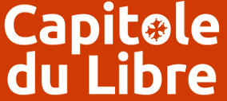
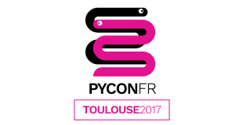

# pybadges

A tool to generates badges for conference attendees and speakers.

Features:
* Print front and back sides
* Group badges per sheet (eg. four A6 badges on one A4 sheet)
* Insert a company logo

## Installation

```sh
uv sync
```

## Usage

It requires a TOML file for configuration and a CSV file from the data. The
configuration file should follow the format of the example called `badges.toml`.
The CSV file should be in the format

    frontside,backside,firstname,lastname,group,logo

`lastname`, `group` and `logo` are optional. `logo` is the path to the company
logo. `frontside`  and `backside` are the paths to the background images to use
on each badge. The images are resized if required.

Typical usage:
```sh
uv run python -m pybadges -c config.toml -i input.csv -o output.pdf
```

For example the following command creates a series of test badges.
```sh
uv run python -m pybadges -c badges.toml -i examples/attendees.csv -o output.pdf -C examples -v
```

### Note
Removing the transparency channel from the badge backgrounds if you don't need it can
increase performances by many folds.

## They use pybadges

| Conference | |
|---|---|
| [Capitole du Libre](https://capitoledulibre.org) |  |
| [DevFest Toulouse](https://devfesttoulouse.fr) |  |
| [Cloud Toulouse](https://cloudtoulouse.com/) |  |
| [Pycon FR 2017](https://www.pycon.fr/2017/) |  |

## License

Licensed under the Apache-2.0 license, https://www.apache.org/licenses/LICENSE-2.0.html
